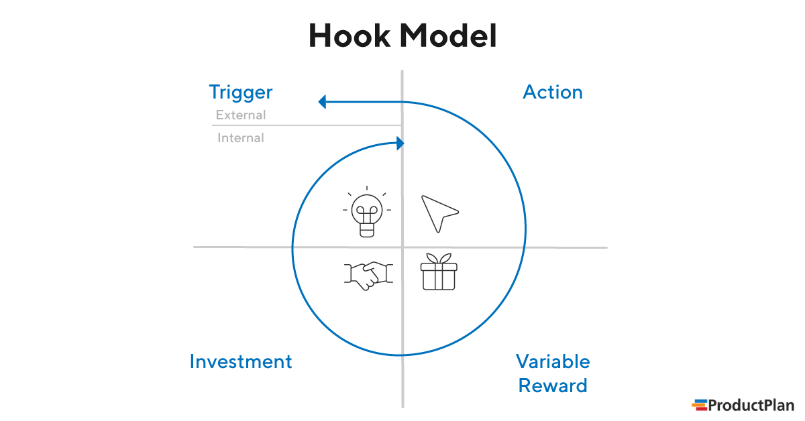

# Business Models related to Product

Hook Models

Refer to this [article](https://www.productplan.com/glossary/hook-model/)

- The Hook Model is a four-phase process to create a customer habit, original by Nir Eyal
- Goal: voluntary, high-frequency engagement
  - Doing something out of <b>Habit</b> Means doing it without even thinking
- 

    - <b>Trigger</b> (External or Internal): This is the actuator of behavior. It cues the action that then builds a habit.
      
      - External triggers:
        - Paid Advertising
        - PR
        - Email Invite
        
      - Internal Triggers
        - Ex: "Feeling bored" -> fire up facebook  and connect with friends
        - "Bored" -> entertainment, gamification
        - "Uncertainty, anxiety" -> give them assurance

    - <b>Action</b>: Behavior executed in anticipation of the reward.
      - Eliminate as many steps as possible from process

    - <b>Variable Reward</b>: The problem that’s solved because of the action taken reinforces the cycle of behavior. Reward types include Rewards of the Tribe (social rewards based on connection and acceptance), Rewards of the Hunt (search for material resources), and Rewards of the Self (personal gratification in the form of mastery or self-realization).
      - Funny photo
      - Something entertaining
      - Something useful
      - Important for the rewards to be <b>variable</b>. Otherwise the consumers will anticipate the rewards and gradually lose interests and don't come back

    - <b>Investment</b>: An action that improves the product or service in the future.
      - Ask for small inverstment
      - Personal contribution
      - Make consumer work a little to store value in the product
        - Stick

- Key questions:

  - What's the internal trigger (what customers want or need)?
  - What's the external trigger (what brings them to your product or service)?
  - What's the action?
  - What's the reward?
  - How do you increase customer engagement with the product in the future?

